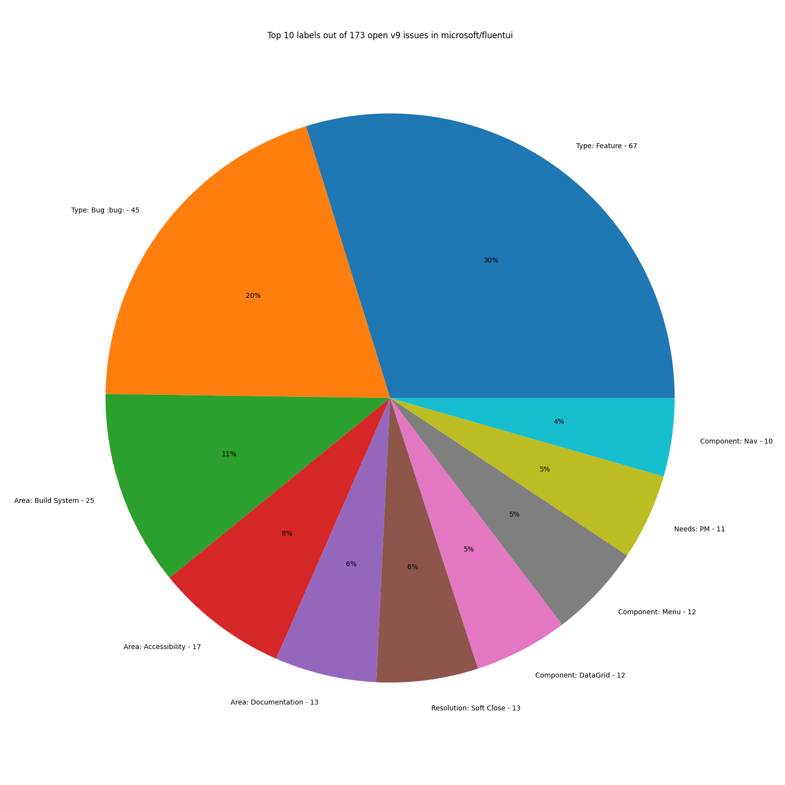
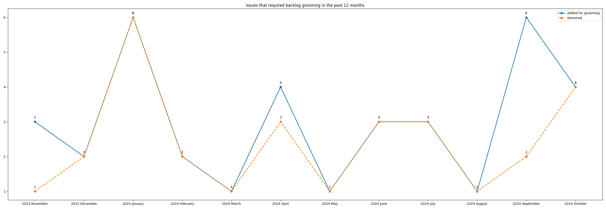

# Fluent UI repository issue stats

This project uses the Github REST API to fetch all v9 issues and generate charts for that data.

## Prerequisites

This project uses [Poetry](https://python-poetry.org/) as package manager, so it needs to be preinstalled before running any command

## Installing

Once you have Poetry installed, you can run:

```bash
poetry install
```

Enter a Poetry shell by running:

```bash
poetry shell
```

Start the Jupyter server by running:

```bash
poetry run jupyter notebook
```

## Current stats







